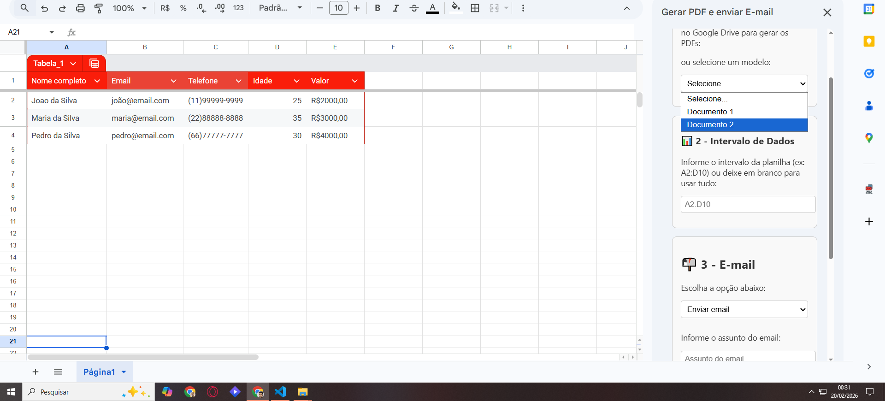

# Mala Direta Automatizada com Google Apps Script

**Solução desenvolvida para reduzir o trabalho manual e zerar erros operacionais na geração de documentos e envio de e-mails em lote.**

Este projeto automatiza o envio de mala direta personalizada a partir de dados no Google Sheets, integrando com Google Docs e Gmail através de uma interface amigável.

## 📌 Funcionalidades
* **Geração em Lote:** Criação automática de PDFs a partir de modelos pré-aprovados no Google Docs.
* **Dados Dinâmicos:** Substituição de placeholders (`{{Nome}}`, `{{E-mail}}`, etc.) pelos dados correspondentes na planilha.
* **Comunicação Automatizada:** Disparo de e-mails personalizados com os PDFs em anexo ou criação de rascunhos no Gmail para aprovação prévia.
* **Organização no Drive:** Salva automaticamente os PDFs gerados em pastas organizadas pelo nome do modelo utilizado.
* **Interface UI:** Menu lateral interativo no Google Sheets (HTML/CSS) para facilitar o uso por usuários não técnicos.

## 🚀 Tecnologias utilizadas
* **Google Apps Script (JavaScript V8)**
* **APIs do Google Workspace:** Sheets, Docs, Drive, Gmail.
* **Front-end:** HTML e CSS embutidos para a Sidebar.

## 📂 Estrutura do projeto
* `MenuLateral.gs` → Controla a interface gráfica (HTML/CSS) e a comunicação entre a interface do usuário e o backend.
* `Funcoes.gs` → Core do sistema (lógica de geração de PDFs, controle de pastas no Drive e envio de e-mails).
* `FuncoesAuxiliares.gs` → Funções utilitárias para manipulação, extração e formatação de datas.
* `appsscript.json` → Manifesto do projeto (configuração de permissões e escopos).

## 🔧 Como usar

1. **Planilha de Dados:**
   * Crie uma planilha no Google Sheets contendo obrigatoriamente a coluna **Nome** ou **Nome completo** (se faltar, o script acusará erro).
   * Para envios automáticos, a coluna **Email** também é obrigatória.
   * Adicione colunas adicionais para substituir placeholders no modelo do Google Docs (ex.: `Curso`, `Data`).

2. **Planilha Auxiliar de Modelos:**
   * Crie uma planilha separada para guardar os IDs dos seus modelos.
   * Coluna A: Nome do Modelo (Ex: Certificado Conclusão)
   * Coluna B: ID do documento no Drive.
   * Cole o ID dessa planilha auxiliar na variável `id_planilha` dentro do arquivo `MenuLateral.gs`.

3. **Modelo do Documento:**
   * Crie um Google Docs com os placeholders correspondentes às colunas da sua planilha (ex.: `{{Nome}}`, `{{Email}}`, `{{Curso}}`).

4. **Importar código:**
   * Cole os arquivos `.gs` no editor de scripts da sua planilha (Extensões > Apps Script).
   * Atualize o `appsscript.json` para incluir o manifesto correto.

5. **Ativar a barra lateral (Modo Add-on):**
   * Para que a sidebar funcione como Add-on, crie um Add-on de teste.
   * No editor do Apps Script, clique em **Executar > Testar Add-on**.
   * Escolha a planilha onde deseja testar o script.
   * A barra lateral aparecerá no menu da planilha em **Extensões > Add-ons > Testar**.

6. **Execução:**
   * Com a Sidebar aberta, selecione o modelo, o intervalo de dados e a preferência de e-mail. Clique em "Iniciar Mala Direta".

## 📬 Exemplo de uso
Imagine uma secretaria acadêmica que precisa enviar certificados para 100 alunos:
1. Basta colocar os nomes e e-mails na planilha.
2. O sistema gera os 100 PDFs com os nomes corretos.
3. Salva todos em uma pasta específica no Drive.
4. Envia o e-mail com o certificado em anexo para cada aluno automaticamente.

🔗 **Autor:** Andrey da Silva Araujo

